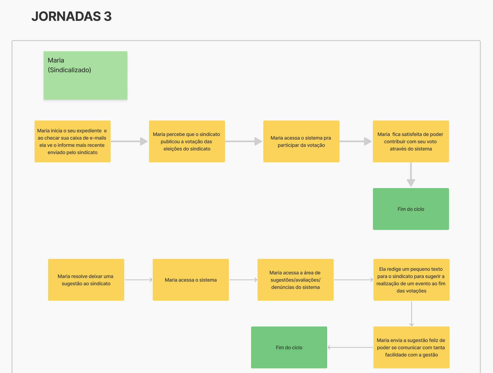
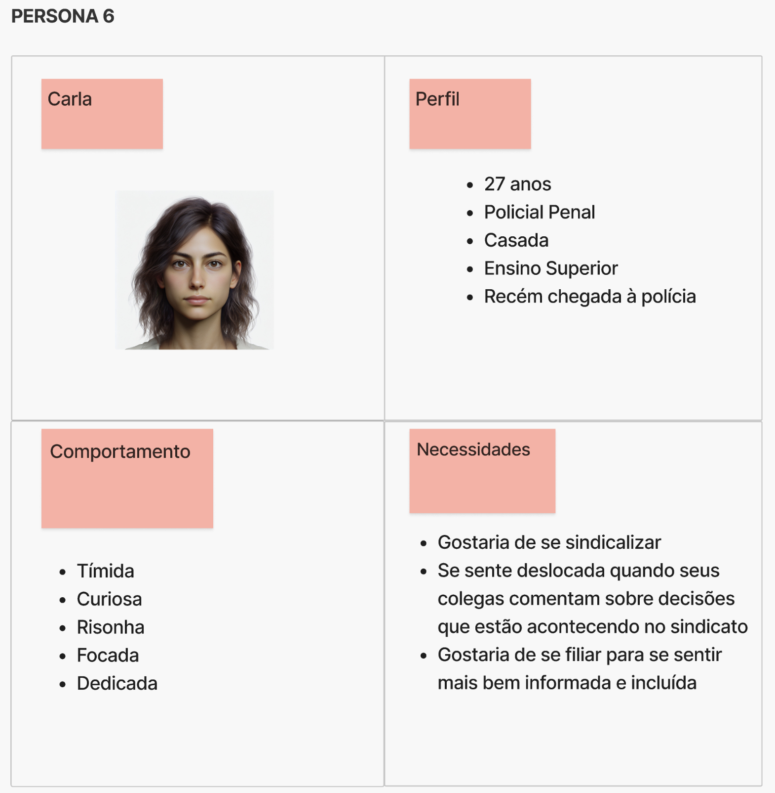
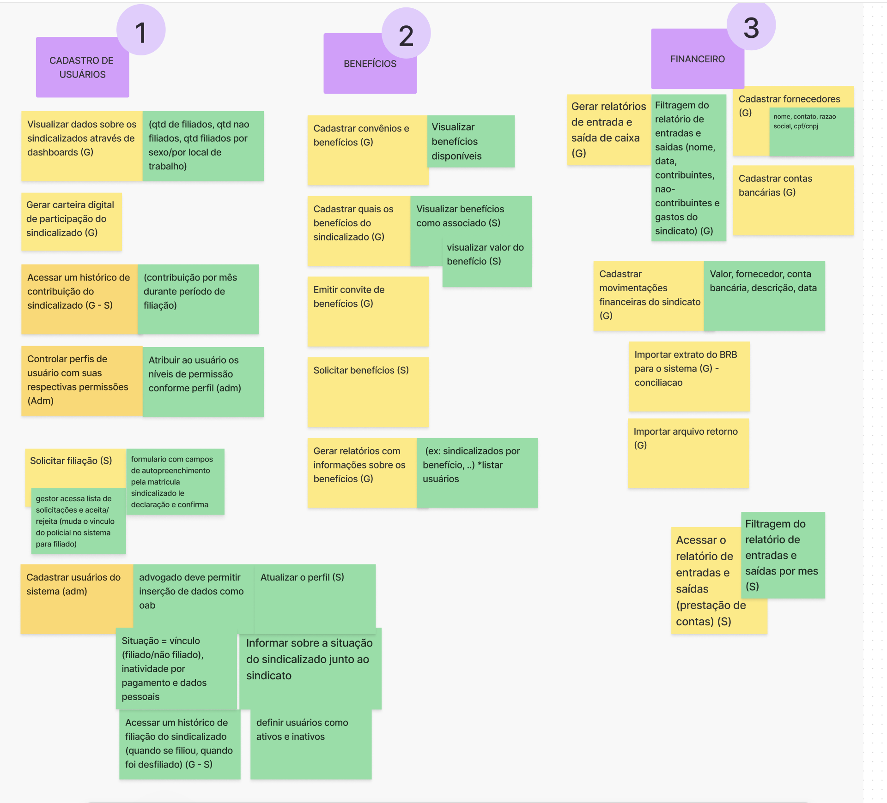
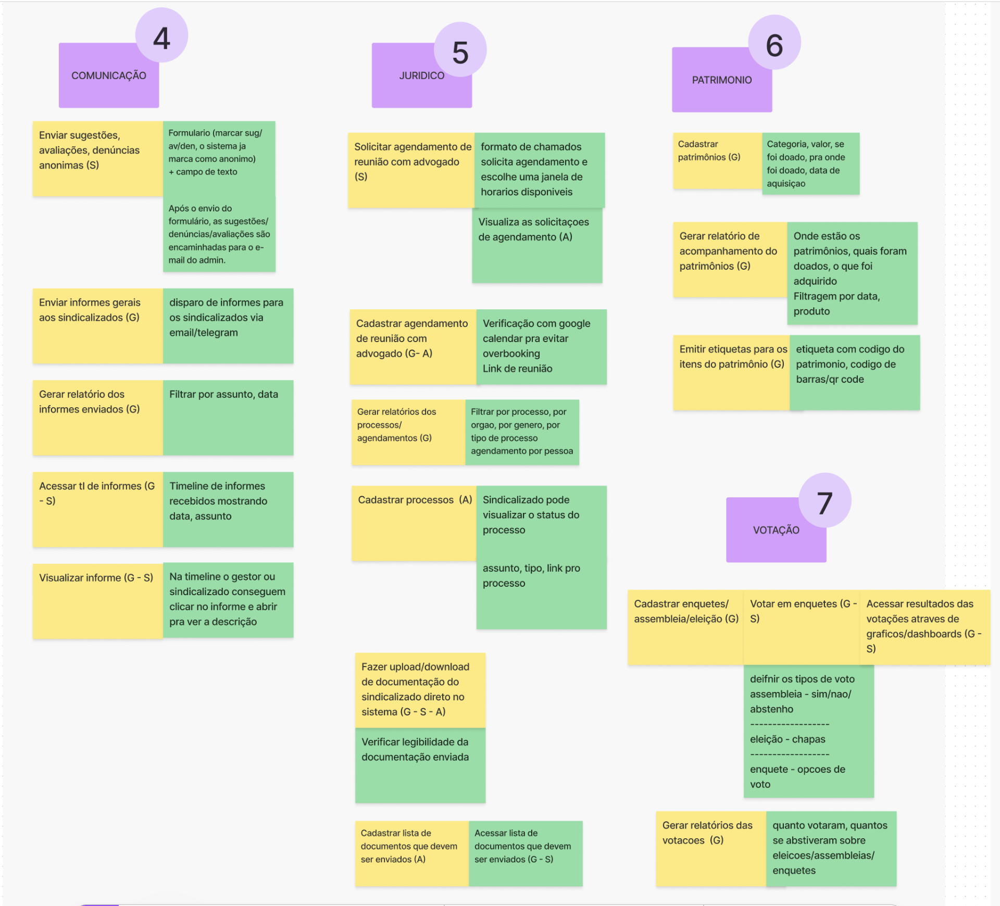

# Lean Inception - Dia 4

## Jornadas de Usuário

As Jornadas de Usuário são o passo a passo do que é executado pela persona para cumprir um objetivo. Assim, são criados estes fluxos de atividades considerando o perfil, comportamento e as necessidades de cada persona..  

## Brainstorming de funcionalidades

Para atender as necessidades das personas, as funcionalidades devem ser pensadas. Neste momento, a atividade requer que os participantes repassem pelos objetivos do produto e pelas jornadas para pensar de maneira mais modular em quais seriam as funcionalidades presentes no produto final enxuto. 

## Revisão técnica e de negócio

Com as funcionalidades pensadas, chega a hora de classificá-las. O método propõe duas formas de classificação: 

1. posicionando num gráfico onde o eixo Y refere-se ao quanto a funcionalidade agrega valor ao produto, enquanto no eixo X qual seria a confiança do time em executar a tarefa;
2. conferindo ao post-it com a funcionalidade valor de esforço, valor de negócio e valor de UX. 

Dessa forma, tem-se o seguinte formato de classificação para os post-its: 

## Reunião 

**Data**: 12/04/24

**Participantes**:

| Equipe | Nomes | 
| - | - |
| EPS | Ingrid Carvalho, Sara Campos, Alvaro Gouvea, Victor Yukio | 
| MDS | Guilherme Storch, Milena Rocha, José Eduardo, Davi Nobre, João Victor Nobre  | 

**Descrição**:

Como descrito no [dia 3](./dia3.md), os estudantes de MDS ficaram responsáveis por se organizar para realizar algumas atividades. Assim, os estudantes construíram as jornadas de usuário que posteriormente foram refinadas pelos estudantes de EPS. Além disso, uma nova persona foi criada conforme foi identificado que era necessário. 

De maneira assíncrona, os POs apontaram algumas correções que resultaram nas seguintes personas e suas respectivas jornadas:

Persona 1 + Jornada:

Persona 2 + Jornada:

Persona 3 + Jornada:

Persona 4 + Jornada:

Persona 5 + Jornada:

Persona 6 + Jornada:

Com essa parte realizada, partimos para reunião em formato presencial (com chamada online para ampliar participação) a fim de fazer nosso Brainstoming de Funcionalidades. Essa etapa consistiu basicamente em uma revisão dos Objetivos do Produto, decompondo alguns post-its ou definindo melhor a funcionalidade que representam. Dessa forma, chegou-se ao seguinte resultado: 

Por fim, finalizamos a reunião construindo a Revisão Técnica e de Negócio. Os post-its do Brainstorming de Funcionalidades foram posicionados no gráfico e a eles foram conferidos valores de esforço técnico, valor de negócio e valor de UX. 

>> Ressalta-se que o progresso feito até este momento ainda requer validação por parte dos POs e deve passar por novas alterações no [dia 5](./dia5.md) de reunião.

## Referências

[Journey Mapping 101](https://www.nngroup.com/articles/journey-mapping-101/)  
Lean Inception: Como alinhar pessoas e construir o produto certo. Caroli, Paulo.

## Histórico de versão

| Alteração | Data | Autor | 
| - | - | - |
| Criação do documento | 15/04/24 | Sara Campos |